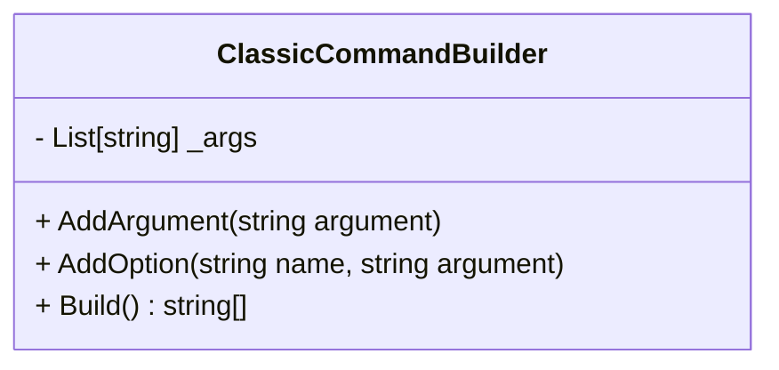
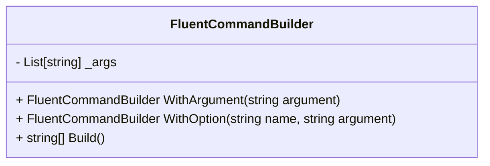
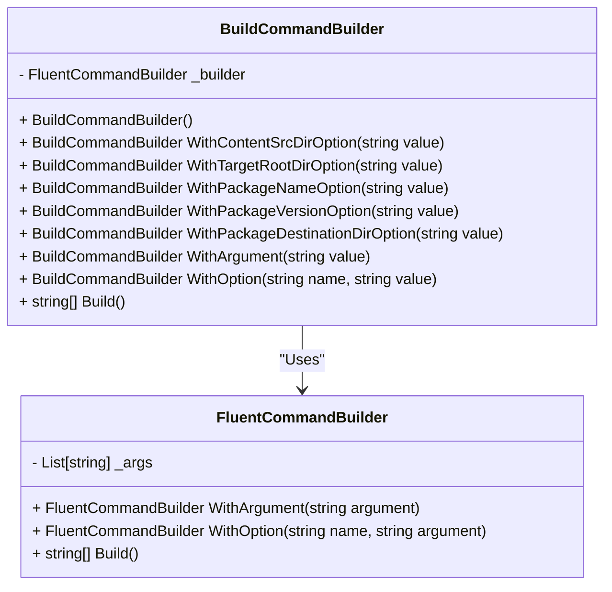
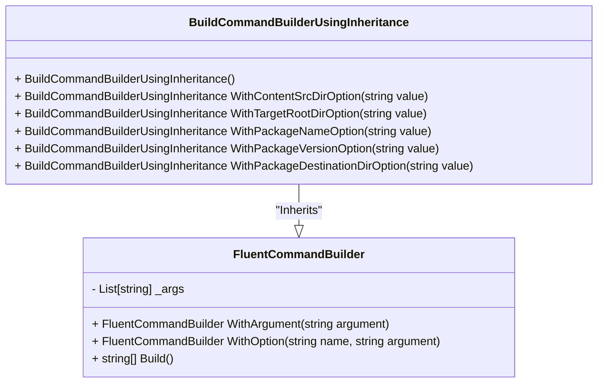

Photo by [Ricardo Gomez Angel](https://unsplash.com/@rgaleriacom?utm_content=creditCopyText&utm_medium=referral&utm_source=unsplash) on [Unsplash](https://unsplash.com/photos/man-in-black-jacket-and-yellow-helmet-jYNvXKTUYvs?utm_content=creditCopyText&utm_medium=referral&utm_source=unsplash)
      
# Introduction
The Builder pattern is one of my favorite programming patterns. It is straightforward, at least in it's basic form, and can significantly enhance code quality. Recently, I used it to perform integration tests for a CLI tool and wanted to share some thoughts.

## Problem
Integration tests are designed to verify how different components work together. For a REST API, this typically involves sending some HTTP requests. For a CLI tool, it requires executing a command with its respective arguments and options.

If I only had a few simple commands, no options and testing just happy paths, I probably wouldn't have bothered with anything fancy. However, the things were getting messy, and I wanted to do something about it. Additionally, the software was in its early stages, and I knew the interface would be changing.

### Sample
Let's consider a sample command I worked on.

``` powershell
gcd nipkg build `
    --content-src-dir 'testdata\nipkg\test-pkg-content' `
    --target-root-dir 'BootVolume/manual-tests/gcd-build-test' `
    --package-name 'gcd-build-test' `
    --package-version '0.5.0-1' `
    --package-destination-dir 'build-test-output-dir'
```

When translated to C# string it looks just awfull.

``` csharp
var command = "gcd nipkg build --content-src-dir 'testdata\\nipkg\\test-pkg-content' --target-root-dir 'BootVolume/manual-tests/gcd-build-test' --package-name 'gcd-build-test' --package-version '0.5.0-1' --package-destination-dir 'build-test-output-dir'
```

But can be easily improved with array of strings.
``` csharp
var command = new  string[]
{
    "gcd",
    "nipkg",
    "build",
    "--content-src-dir", "testdata\nipkg\test-pkg-content",
    "--target-root-dir", "BootVolume/manual-tests/gcd-build-tes",
    "--package-name","cd-build-test",
    "--package-version","0.5.0-1",
    "--package-destination-dir","build-test-output-dir"
};
```
This approach is simple and relatively clean in relation to required code but got some downsides:
* Section `"gcd","nipkg","build"` need to be repeated for every call.
* Option names need to be memorized by programmer (me) or checked/copied every single time.
* Option names are being repeated with every call and when they change, need to be replaced everywhere.

If I were building interface for a command to use in a software, I would probably use some DTO and function to call the command.
``` csharp
public record BuildCommandDto(
    string ContentSrcDir,
    string TargetDir,
    string PackageName,
    string PackageVersion,
    string PackageDestinationDir);
```

However, in this particular case, I wanted the flexibility to:

- Send a command with an unsupported option. 
- Execute a command without a required option.
- Include a command with a typo.

While still ensuring that I:

- Don't have to memorize option names.
- Avoid repeating the beginning of the command.
- Can update an option in one place if changes are needed.

I know, it is like eating an apple and having an apple but it is possible with builders.

## Builders
Before getting to the actuall solution, let me start with some builder examples.

There are quite a few variation of builder pattern like:
* **Classic Builder**
* **Fluent Builder**
* **Fluent Builder With Recursive Generics**
* **Faceted Builder**

but I will focus on just the basic ones:
* **Classic Builder**
* **Fluent Builder**

The initial examples do not solve the actuall problem. They are actually very similar to building an array. Their sole purpose is to show differences between **Classic** and **Fluent** Builders.

### Clasic Builder
I rarely use the **Classic Builder**, not because it's bad, but simply because I love the **Fluent Builder** syntax so much that I prefer it over anything else. However, **Fluent Builder** can present some challenges with inheritance, so I wanted to show that there are alternatives.

#### Usage
``` csharp
var builder = new ClassicCommandBuilder();
builder.AddArgument("gcd");
builder.AddArgument("nipkg");
builder.AddArgument("build");
builder.AddOption("--content-src-dir","testdata\\nipkg\\test-pkg-content");
builder.AddOption("--target-root-dir","BootVolume/manual-tests/gcd-build-test");
builder.AddOption("--package-name","cd-build-test");
builder.AddOption("--package-version","0.5.0-1");
builder.AddOption("--package-destination-dir","build-test-output-dir");
var command = builder.Build();
```

#### Implementation
``` csharp
public class ClassicCommandBuilder
{
    private readonly List[string] _args = [];
    public void AddArgument(string argument)
    {
        _args.Add(argument);
    }
    public void AddOption(string name, string argument)
    {
        _args.Add(name);
        _args.Add(argument);
    }
    public string[] Build() => _args.ToArray();
}
```

#### Diagram

### Fluent Builder
**Fluent Builder** is my go-to when it comes to builders.
A fluent interface lets you chain functions together, and it's pretty simple to set up. The key is that each function should return the Builder itself.

#### Usage
```csharp
var command = new FluentCommandBuilder()
    .WithArgument("gcd")
    .WithArgument("nipkg")
    .WithArgument("build")
    .WithOption("--content-src-dir", "testdata\\nipkg\\test-pkg-content")
    .WithOption("--target-root-dir", "BootVolume/manual-tests/gcd-build-test")
    .WithOption("--wrong-name-option", "cd-build-test")
    .WithOption("--package-version", "0.5.0-1")
    .WithOption("--package-destination-dir", "build-test-output-dir")
    .Build();
```

#### Implementation
```csharp
public class FluentCommandBuilder
{
    private readonly List[string] _args = [];
    public FluentCommandBuilder WithArgument(string argument)
    {
        _args.Add(argument);
        return this;
    }
    public FluentCommandBuilder WithOption(string name, string argument)
    {
        _args.Add(name);
        _args.Add(argument);
        return this;
    }
    public string[] Build() => _args.ToArray();
}
```
#### Diagram

## Solution
`FluentCommandBuilder` improved the interface slightly but not as much for me to choose it over `string[]` implementation. The actual solution is presented below. This approach gives me the best results:
* begining of the command is prepended automatically
* no need to remember all the option names
* option names can be changed in one place
* neat syntax
* can remove some options for testing purposes
* can introduce some typos in option name for testing purposes

> Note: I have reused 'FluentArgumentsBuilder' using composition and created methods `WithArgument`, `WithOption` that delegates work to `FluentArgumentsBuilder`

 As much as I would like to say it's because I favour 'composition over inheritance', which I do, this is not the case. The actual truth is that I wanted to use inheritance here. I got some commands which share the same options and this approach could save me a lot of work but I couldn't. At least in the first attempt.

#### Usage
```csharp
var command = new BuildCommandBuilder()
    .WithContentSrcDirOption("testdata\\nipkg\\test-pkg-content")
    .WithTargetRootDirOption("BootVolume/manual-tests/gcd-build-test")
    .WithOption("--wrong-name-option","test") 
    .WithPackageVersionOption("0.5.0-1")
    .WithPackageDestinationDirOption("build-test-output-dir")
    .Build();
```

#### Implementation
```csharp
public class BuildCommandBuilder
{
    private readonly FluentCommandBuilder _builder = new();

    public BuildCommandBuilder()
    {
        _builder.WithArgument("gcd");
        _builder.WithArgument("nipkg");
        _builder.WithArgument("build");
    }

    public BuildCommandBuilder WithContentSrcDirOption(string value)
    {
        _builder.WithOption("--content-src-dir", value);
        return this;
    }
    
    public BuildCommandBuilder WithTargetRootDirOption(string value)
    {
        _builder.WithOption("--target-root-dir", value);
        return this;
    }
    
    public BuildCommandBuilder WithPackageNameOption(string value)
    {
        _builder.WithOption("-package-name", value);
        return this;
    }
    
    public BuildCommandBuilder WithPackageVersionOption(string value)
    {
        _builder.WithOption("--package-version", value);
        return this;
    }

    public BuildCommandBuilder WithPackageDestinationDirOption(string value)
    {
        _builder.WithOption("--package-destination-dir", value);
        return this;
    }
    
    public BuildCommandBuilder WithArgument(string value)
    {
        _builder.WithArgument(value);
        return this;
    }
    
    public BuildCommandBuilder WithOption(string name, string value)
    {
        _builder.WithOption(name, value);
        return this;
    }
    public string[] Build() =>
        _builder.Build();
}
```
#### Diagram

### Fluent Builder with intheritance
#### Problem
At the core of **Fluent Builder** is the fact that it returns itself. As soon as you use method of parent class, it will return parent builder and you won't have access to child class methods anymore. This problem does not exist with **Classic Builder** since you don't depend on what the method returns and mutate builder's data instead. On the other hand you could use **Fluent Builder** the same way **Clasic Builder** is used but then what's the point creating it this way in the first place.

Let's consider implementation below. The line 5 will cause a compilation error.

#### Usage - broken
``` csharp
var command = new BuildCommandBuilderUsingInheritance()
    .WithContentSrcDirOption("testdata\nipkg\test-pkg-content")
    .WithTargetRootDirOption("BootVolume/manual-tests/gcd-build-test")
    .WithOption("--wrong-name-option","test") 
    .WithPackageVersionOption("0.5.0-1")
    .WithPackageDestinationDirOption("build-test-output-dir")
    .Build();
```

#### Implementation
```csharp
public class BuildCommandBuilderUsingInheritance : FluentCommandBuilder
{
    public BuildCommandBuilderUsingInheritance()
    {
        WithArgument("gcd");
        WithArgument("nipkg");
        WithArgument("build");
    }

    public BuildCommandBuilderUsingInheritance WithContentSrcDirOption(string value)
    {
        WithOption("--content-src-dir", value);
        return this;
    }
    
    public BuildCommandBuilderUsingInheritance WithTargetRootDirOption(string value)
    {
        WithOption("--target-root-dir", value);
        return this;
    }
    
    public BuildCommandBuilderUsingInheritance WithPackageNameOption(string value)
    {
        WithOption("-package-name", value);
        return this;
    }
    
    public BuildCommandBuilderUsingInheritance WithPackageVersionOption(string value)
    {
        WithOption("--package-version", value);
        return this;
    }

    public BuildCommandBuilderUsingInheritance WithPackageDestinationDirOption(string value)
    {
        WithOption("--package-destination-dir", value);
        return this;
    }
}
```
#### Diagram

#### Solution
The solution to this chalange is **Fluent Builder With Recursive Generics** and I will be covering this in the future posts.

